# Dockerized Web Application on AWS ECS Fargate

This project demonstrates how to containerize a web application using Docker and deploy it to AWS using ECS Fargate behind an Application Load Balancer.

The goal of this project was to simulate a production-style container deployment while gaining hands-on experience with containerized workloads and AWS container services.

---

# Production Architecture

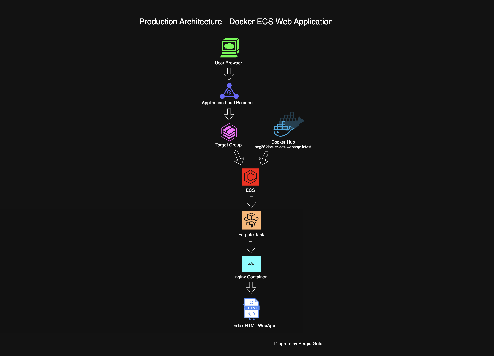

Architecture flow:

User Browser  
↓  
Application Load Balancer  
↓  
Target Group  
↓  
ECS Service  
↓  
Fargate Task  
↓  
Docker Container (NGINX)  
↓  
Web Application (index.html)

The container image is stored in Docker Hub and pulled by ECS during deployment.

---

# Technologies Used

- Docker
- Docker Hub
- AWS ECS
- AWS Fargate
- Application Load Balancer
- Target Groups
- Security Groups
- Cloud Networking

---

# Project Workflow

The deployment followed these main steps:

1. Build the Docker image locally
2. Run the container locally for testing
3. Push the image to Docker Hub
4. Create an ECS Cluster
5. Define the ECS Task Definition
6. Deploy an ECS Service using Fargate
7. Attach an Application Load Balancer
8. Configure Target Groups and health checks
9. Verify the running application

---

# Project Screenshots

## Project Structure

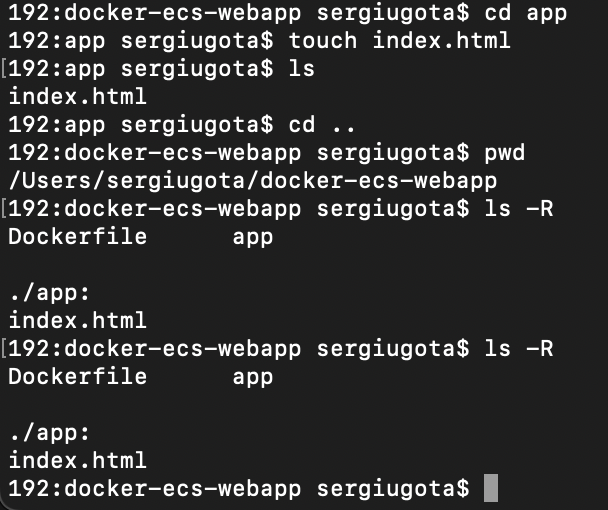

---

## Docker Image Built

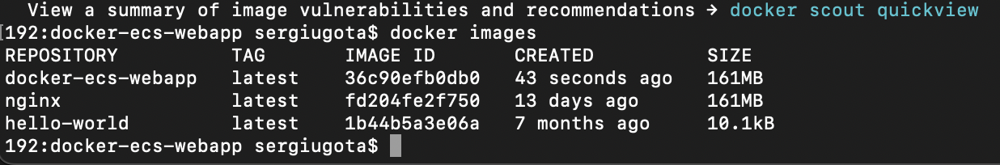

---

## Container Running

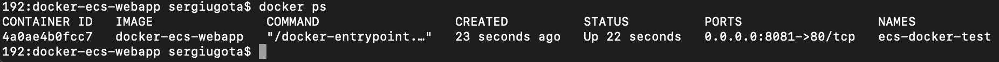

---

## Local Web Application

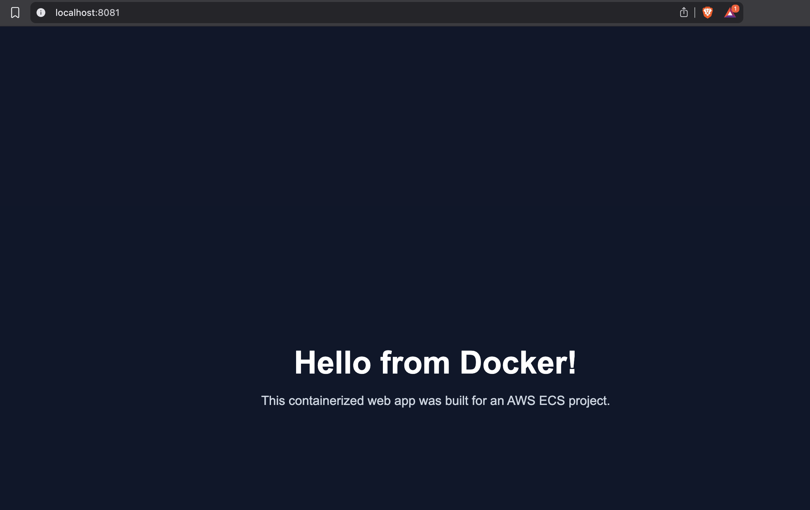

---

## Docker Hub Repository

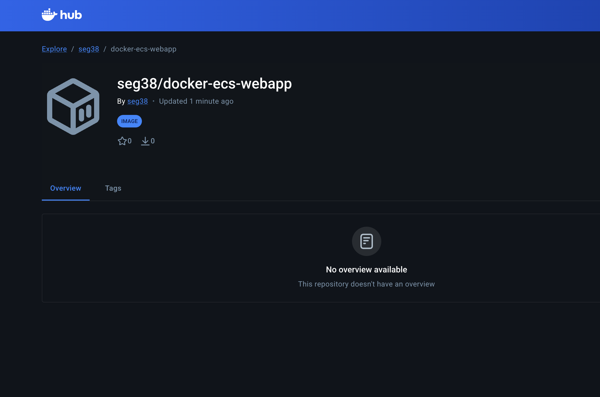

---

## ECS Cluster Created

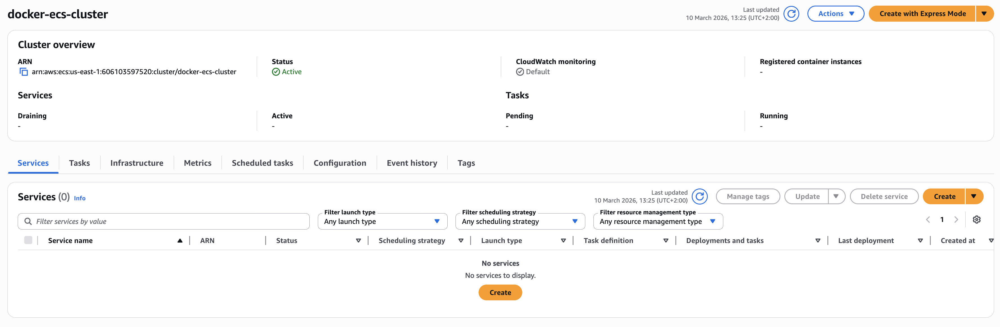

---

## Task Definition

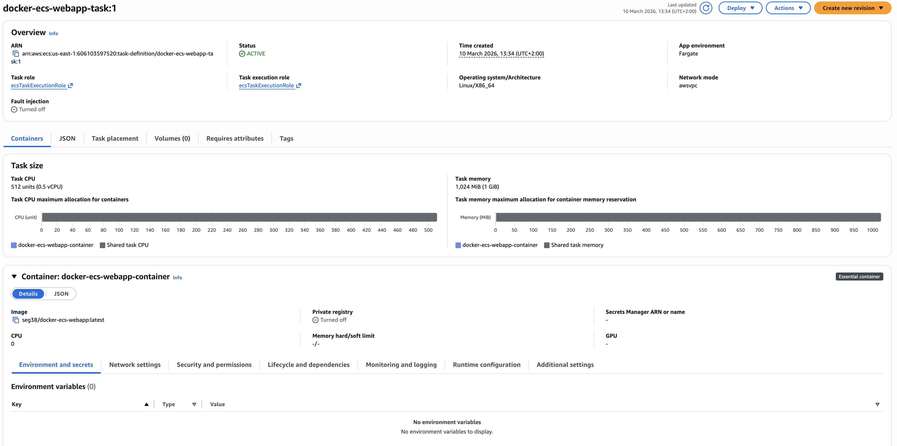

---

## ECS Service Running

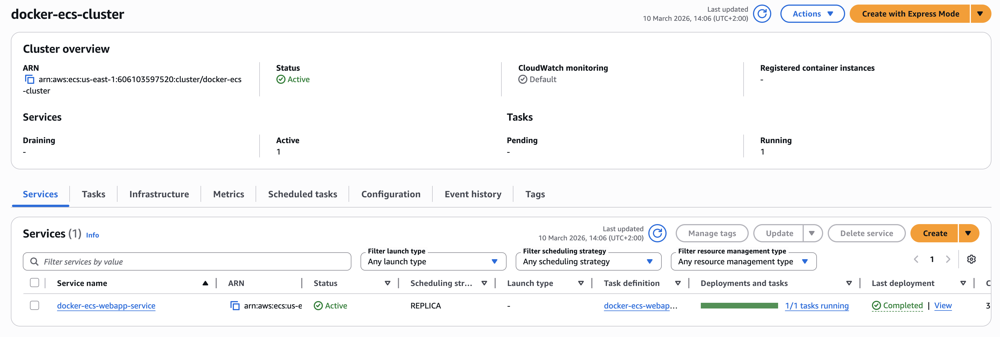

---

## Application Load Balancer

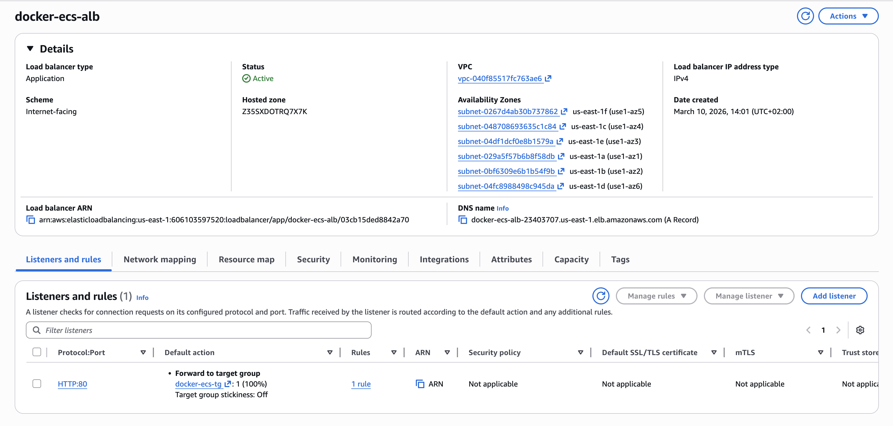

---

## Target Group Healthy

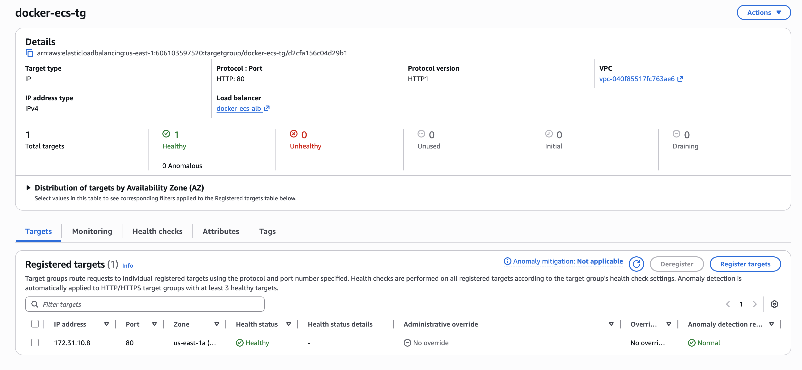

---

## Application Running

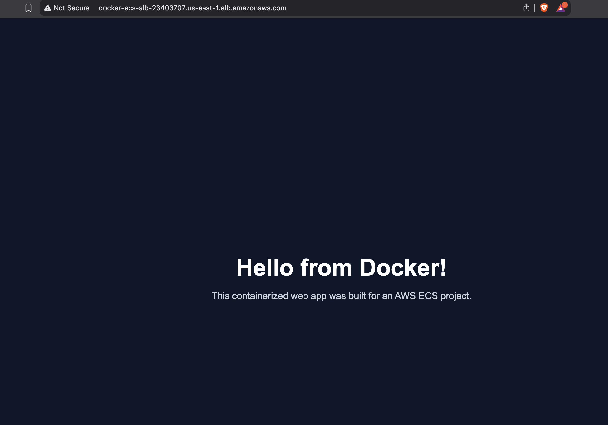

---

# Troubleshooting

During deployment several common issues needed troubleshooting:

- Container port configuration
- Security group rules
- Load balancer health checks
- ECS networking configuration
- Docker image accessibility

These troubleshooting steps reflect common real-world container deployment scenarios.

---

# What This Project Demonstrates

This project demonstrates practical experience with:

- Containerizing applications using Docker
- Publishing container images to Docker Hub
- Running containers using AWS ECS
- Using AWS Fargate for serverless container execution
- Exposing services with an Application Load Balancer
- Configuring health checks and target groups
- Troubleshooting networking and deployment issues

---

# Future Improvements

Possible improvements include:

- CI/CD pipeline with GitHub Actions
- Infrastructure as Code with Terraform
- CloudWatch monitoring and logging
- HTTPS with AWS Certificate Manager
- Auto Scaling configuration

---

# Author

Sergiu  
AWS Certified Solutions Architect – Associate  
AWS Certified Cloud Practitioner
